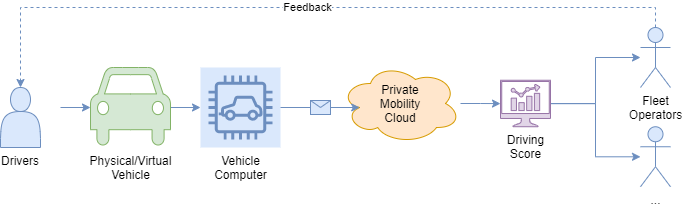

# Eclipse SDV Hackathon on BCX2022

_*** Updated 2022-11-08 13:37 - [KNOWN_ISSUES.md](./KNOWN_ISSUES.md) ***_

One-Pager ([PowerPoint](./assets/BCX_Onepager_DriverScore_A0.pptx), [PDF](./assets/BCX_Onepager_DriverScore_A0.pdf))

# Welcome to the "Driving Score" hack challenge!

Your goal is to **improve the quality of a driver's driving style**. The use case is well-known, there are already some commercial offerings available. As a hack challenge for Eclipse SDV, it's a good use case to try out the involved technology and experience some of the challenges when dealing with connected vehicles. You will also get to know a few more open source projects along the way.

In this hack challenge, you can

- **show how connected vehicle data improves safety and ecological footprint**. A better driving style leads to safer roads, less energy consumption, smaller carbon footprint. For some, it's even an incentive to safe money on insurance costs.
- **explore the Eclipse SDV ecosystem** of open source projects, such as programming models, middleware and protocol implementations.
- **combine exciting open source technology** from robotics, internet of things, cloud and automotive

The rough plan is to read vehicle data such as speed, acceleration and break information into a Vehicle App, **calculate a driving score** based on these input data and then send the score to another service - maybe an alert to the driver, or a remote webservice, visualize it on a dashboard or use it as a feedback input to a self-learning AI algorithm. It's up to your hack team's creativity.

Your hack team should have the following skills:

- Some **development skills** in a programming language - Python, GoLang, Rust, C++ or even Java are good candidates.
- Rudimentary **Linux, git, shell skills** are always a plus. Some knowledge in network protocols such as MQTT is good. You don't need to be an expert in automotive specific tech such as CAN-Bus, Some/IP or AutoSAR.
- Compiling, building and cross-compilation basics are needed as well. Your app may run on your x86-based development laptop, but does it also run on the ARM-based target device?
- A bit of **Docker, containerd, k8s** experience would be good as well, for building your app as a container and deploy it to a container runtime on the device.
- If you're in for some more advanced stuff, run your application on the Xen Hypervisor together with a ROS based system.

As we want to focus on the technology exploration and integration, consider the following steps as exemplary, you're free to chose your own set of technology of course.

[Step 1 - Identify needed input signals](docs/step-1-identify-signals.md)

[Step 2 - Design the architecture and data flow](docs/step-2-architecture-data-flow.md)

[Step 3 - Identify the needed components](docs/step-3-pick-components.md)

[Step 4 - Implement the driving score vehicle app](docs/step-4-driving-score-app.md)

[Step 5 - Build and deploy to a device](docs/step-5-build-deploy.md)

Happy hacking!
