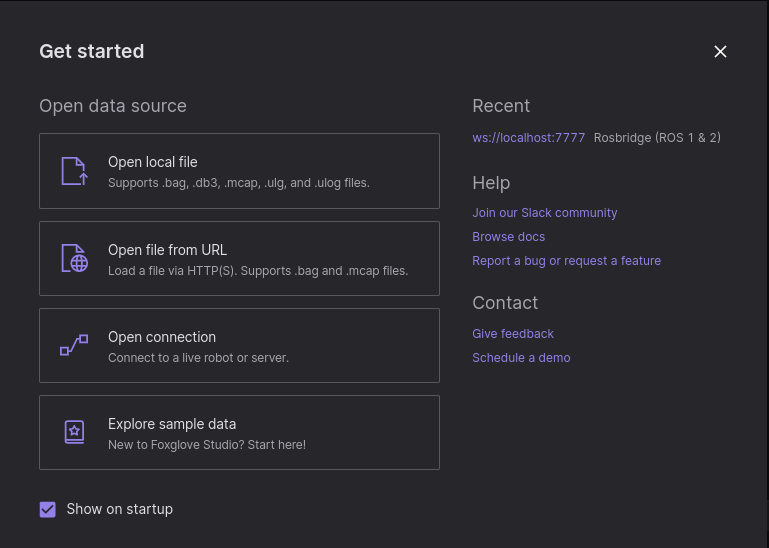
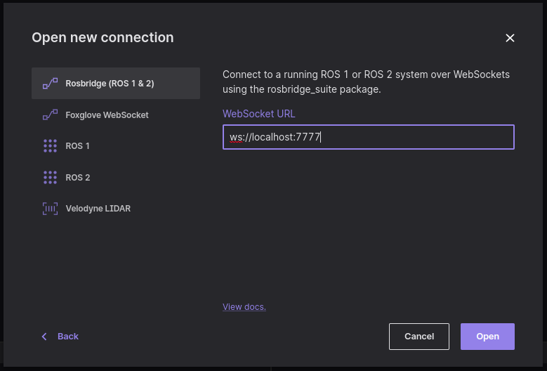
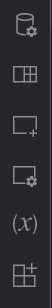
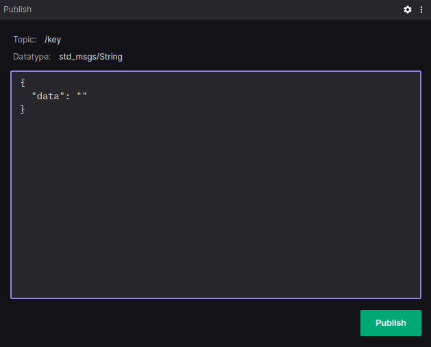

# Hack Challenge "Driving Score"
## Step 0 - Evaluate SDV Domains

You can choose to use any one of the SDV domains such as Eclipse Leda, or Eclipse Muto (ROS Domain), which will provide you the tools including in-vehicle data collection, sharing data to the cloud as well as building dashboards and widgets to visualize your solutios. Please refer to [Step 2: Architecture and Data Flow](./step-2-architecture-data-flow.md) for potential data flows. 

## Step 1 - Identify needed input signals

The [Vehicle Signal Specification](https://github.com/COVESA/vehicle_signal_specification) is supported by [Eclipse Velocitas](https://github.com/eclipse-velocitas) and [Eclipse Kuksa.VAL Databroker](https://github.com/eclipse/kuksa.val). The [Kuksa.VAL DBC Feeder](https://github.com/eclipse/kuksa.val.feeders) has an example recording of raw vehicle signals in the form of a [recorded CAN-Bus network session log](https://github.com/eclipse/kuksa.val.feeders/blob/main/dbc2val/candump.log) file, including the mapping to a specific vehicle model.

It's the easiest way to get simulated data. It's a static recording and will run in a loop though, you won't be able to influence the simulation. However, all of these components can be run in a docker container, which makes it easy and convenient to use - and even run on a headless edge device with a container runtime. In a later step, if you have more time, check out some other vehicle simulators such as [CARLA](https://carla.readthedocs.io/) or [F1Tenth](https://f1tenth.readthedocs.io/en/stable/), maybe you can integrate these as well.

ROS domain can provide you drive data from a simulated racecar driving in race tracks using different maps.  You can have the test car drive autonomously with reactive algorithms such as gap follower, time eleastic band (TB) with global and local planners or manually using keyboard or a joystick.   F1Tenth.org reactive algorithms such as and simulted vehicles. You can use all the the sensor data published by the simulator and AckermannDrive messages for the information such as the steering angles, velocity etc. [F1Tenth] TODO: Provide a page with quick video descriptions

## Vehicle Signals

On [digital.auto](http://digital.auto), you will find a [playground](https://www.digitalplaybook.org/index.php?title=Overview:_playground.digital.auto) for SDV-related use cases and a catalogue of vehicle signals. The [beta app](https://digitalauto.netlify.app/) contains a CVI catalog of the latest COVESA VSS release and helps you identify standardized vehicle signals:


Example vehicle signals which may be useful for calculating a driving score:
- Vehicle.Speed
- Vehicle.AverageSpeed
- Vehicle.Acceleration
- Vehicle.Chassis.Axle.Row1.WheelDiameter
- Vehicle.Chassis.SteeringWheel.Angle
- Vehicle.Powertrain.Transmission.CurrentGear


Let's continue with `Vehicle.Speed` as an example.

## Run a pre-recorded simulation

We'll be using Eclipse Kuksa's DBC Feeder to read some pre-recorded data and feed it into the data broker, so that we can see how te data looks like.

1. Run [Eclipse Kuksa.VAL Data Broker](https://github.com/eclipse/kuksa.val/tree/master/kuksa_databroker):

        docker run --rm -it -p 55555:55555/tcp ghcr.io/eclipse/kuksa.val/databroker:master

2. Run the Eclipse Kuksa.VAL DBC2VAL Feeder
    
        git clone https://github.com/eclipse/kuksa.val.feeders
        cd kuksa.val.feeders/dbc2val
        python3 ./dbcfeeder.py

    *Hint:* You may need to fix the dbcfeeder.py to allow truncated values, as there is a [known issue](https://github.com/eclipse/kuksa.val/issues/374)

    You can now see which vehicle signals are found in the recorded data file.

    

3. Run the databroker-cli

        git clone https://github.com/eclipse/kuksa.val
        cd kuksa.val/kuksa_databroker
        cargo run --bin databroker-cli

    Type `get veh&lt;tab&gt;sp&lt;tab&gt;`, which will expand to `get Vehicle.Speed`

    

    Use `subscribe SELECT Vehicle.Speed WHERE Vehicle.Speed > 0` you would get continuous updates.

In your application, you will access the Eclipse Kuksa Data Broker by its gRPC interface instead of the databroker-cli tool.

## Drive Messages from ROS

Muto will make it very easy to start and collect data from the F1Tenth race car. Just follow these steps to get Muto and F1Tenth race car running:

TODO: Add the steps and the video link


## Start a simulated racecar with Muto

We'll use a Muto docker image to start a simulated racecar by following the given steps. 
(The simulation visualization is achieved with Foxglove)

After [installing](https://docs.docker.com/engine/install/ubuntu/) docker on your system;

## Create the "buildall" shell file in order to clone needed files into your directory.

Build base ROS image with adiitional ros packages (i.e. ackermann), python packages.
 
## Clone f1tenth gap-wall follower examples
```bash
git clone git@gitlab.eteration.com:composiv/f1tenth/learning/cass_wall_follower.git docker/demo/src/cass_wall_follower
```
```bash
git clone git@gitlab.eteration.com:composiv/f1tenth/learning/cass_gap_follower.git docker/demo/src/cass_gap_follower
```
```bash
git clone git@gitlab.eteration.com:composiv/f1tenth/learning/cass_safety.git docker/demo/src/cass_safety
```

and set python3 as default python.
```bash
docker build -t  composiv/ros:noetic-desktop-full docker/ros
```

## Build base muto image ontop of ROS (previous step)
## Adds msgs, -core, agent and composer + default launch and config files

```bash
docker build -t  composiv/muto:latest docker/muto/
```
## Build base muto image with f1tenth + teb demo algorithms on top of Muto (previous step)
   
   Adds also creates a rosbridge for ws (roserver suite).

```bash
docker build -t  composiv/muto-demo:latest docker/demo/
```

## Launch LiveUI

Now we'll use the given commands to launch the dashboard.

1. 
```bash
npm install
```
2. 
```bash
npm run start
```

The dashboard should open in your designated brower.

In the dashboard go to ``Vehicles``.

Select the online vehicle.

Go to ``Stacks``.

For the demonstration select `Example - Reactive Gap Follower` and click `set`.

Then your stack is set on the designated vehicle. Now you should be able to start the stack on the vehicle by clicking `start`.

## Foxglove

Now, we'll run the commmands necessary to visualize the simulation through foxglove.

To start the simulator 

```bash
docker run --rm -it -v $(pwd)/mike.yaml:/home/muto/launch/config/muto.yaml -p 7777:7777 composiv/muto-demo:latest /bin/bash -c "source devel/setup.bash && roslaunch launch/muto.launch"
```

Now here you can substitute your own ```.yaml ``` file for ```mike.yaml``` using the command above. It replaces the yaml file then runs the simulator.

After the successful start, open your web browser and go to the [foxglove](https://studio.foxglove.dev/?layoutId=6fa30c07-f383-4b8d-9111-09947663e371) webpage.

The given popup will greet you here. 



1. Navigate to ``Open connection``. Then the given page will greet you.




Here the default value is ``ws://localhost:9090``. 

2. Substitute ``9090`` with your desired port ID (the set given to you will have 7777 as the port ID).

After this step you can click Open.

Now, you'll need to click `Add Panel` (3rd from the top)



In order for the vehicle to run autonomously you'll need to send the desired input through the multiplexer.

For this to happen you need to add a `publish` panel.

After selecting publish, type `/key` into the topic scratch pad.

The data type should appear automatically, in case it doesn't, the data type is `std_msgs/String`



## Keystroke inputs for publish panel

N : Navigate i.e Autopilot.

K : Switch the input device to Keyboard.

W : Go Forward.

A : Steer Left.

S : Go Backward.

D : Steer Right.


## Add and display telemetry for Drive messages

TODO: 


Next: [Step 2: Architecture and Data Flow](./step-2-architecture-data-flow.md)
