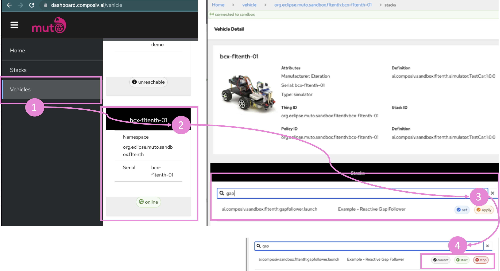

# Hack Challenge "Driving Score"
## Step 0 - Evaluate SDV Domains

You can choose to use any one of the SDV domains such as Eclipse Leda, or Eclipse Muto (ROS Domain), which will provide you the tools including in-vehicle data collection, sharing data to the cloud as well as building dashboards and widgets to visualize your solutios. Please refer to [Step 2: Architecture and Data Flow](./step-2-architecture-data-flow.md) for potential data flows. 

## Step 1 - Identify needed input signals

The [Vehicle Signal Specification](https://github.com/COVESA/vehicle_signal_specification) is supported by [Eclipse Velocitas](https://github.com/eclipse-velocitas) and [Eclipse Kuksa.VAL Databroker](https://github.com/eclipse/kuksa.val). The [Kuksa.VAL DBC Feeder](https://github.com/eclipse/kuksa.val.feeders) has an example recording of raw vehicle signals in the form of a [recorded CAN-Bus network session log](https://github.com/eclipse/kuksa.val.feeders/blob/main/dbc2val/candump.log) file, including the mapping to a specific vehicle model.

It's the easiest way to get simulated data. It's a static recording and will run in a loop though, you won't be able to influence the simulation. However, all of these components can be run in a docker container, which makes it easy and convenient to use - and even run on a headless edge device with a container runtime. In a later step, if you have more time, check out some other vehicle simulators such as [CARLA](https://carla.readthedocs.io/) or [F1Tenth](https://f1tenth.readthedocs.io/en/stable/), maybe you can integrate these as well.

ROS domain can provide you drive data from a simulated racecar driving in race tracks using different maps.  You can have the test car drive autonomously with reactive algorithms such as gap follower, time eleastic band (TB) with global and local planners or manually using keyboard or a joystick.   F1Tenth.org reactive algorithms such as and simulted vehicles. You can use all the the sensor data published by the simulator and AckermannDrive messages for the information such as the steering angles, velocity etc. [F1Tenth] TODO: Provide a page with quick video descriptions

## Vehicle Signals

On [digital.auto](http://digital.auto), you will find a [playground](https://www.digitalplaybook.org/index.php?title=Overview:_playground.digital.auto) for SDV-related use cases and a catalogue of vehicle signals. The [beta app](https://digitalauto.netlify.app/) contains a CVI catalog of the latest COVESA VSS release and helps you identify standardized vehicle signals:


Example vehicle signals which may be useful for calculating a driving score:
- Vehicle.Speed
- Vehicle.AverageSpeed
- Vehicle.Acceleration
- Vehicle.Chassis.Axle.Row1.WheelDiameter
- Vehicle.Chassis.SteeringWheel.Angle
- Vehicle.Powertrain.Transmission.CurrentGear

## Where do I get the Drive Data?

Let's continue with `Vehicle.Speed` as an example. We provide alternate ways to obtain this information. You can use data from a pre-recorded drive data or you can use an F1Tenth simulated car with autonomous or remote controlled driving. The following sections describe these methods. First using  Eclipse Kuksa's DBC Feeder to read some pre-recorded data, and second using Eclipse Muto to start a F1Tenth simulated car.

## Run a pre-recorded simulation

We'll be using Eclipse Kuksa's DBC Feeder to read some pre-recorded data and feed it into the data broker, so that we can see how te data looks like.

1. Run [Eclipse Kuksa.VAL Data Broker](https://github.com/eclipse/kuksa.val/tree/master/kuksa_databroker):

        docker run --rm -it -p 55555:55555/tcp ghcr.io/eclipse/kuksa.val/databroker:master

2. Run the Eclipse Kuksa.VAL DBC2VAL Feeder
    
        git clone https://github.com/eclipse/kuksa.val.feeders
        cd kuksa.val.feeders/dbc2val
        python3 ./dbcfeeder.py

    *Hint:* You may need to fix the dbcfeeder.py to allow truncated values, as there is a [known issue](https://github.com/eclipse/kuksa.val/issues/374)

    You can now see which vehicle signals are found in the recorded data file.

    

3. Run the databroker-cli

        git clone https://github.com/eclipse/kuksa.val
        cd kuksa.val/kuksa_databroker
        cargo run --bin databroker-cli

    Type `get veh&lt;tab&gt;sp&lt;tab&gt;`, which will expand to `get Vehicle.Speed`

    

    Use `subscribe SELECT Vehicle.Speed WHERE Vehicle.Speed > 0` you would get continuous updates.

In your application, you will access the Eclipse Kuksa Data Broker by its gRPC interface instead of the databroker-cli tool.

## Drive Messages from ROS

Muto will make it very easy to start and collect data from the F1Tenth race car. Just follow these steps to get Muto and F1Tenth race car running:

TODO: Add the steps and the video link


## Start a simulated racecar with Muto

We'll use a Muto docker image to start a simulated racecar by following the given steps. 
(The simulation visualization is achieved with Foxglove)

After [installing](https://docs.docker.com/engine/install/ubuntu/) docker on your system;


To start the simulator you will need to provide a name to you simualted car, (i.e. bcx-f1tenth-01), and launch your simulation.  Let's assume you named your file example.yaml (you can find a sample [here](sources/muto/example.yaml) ).
```yaml
muto:
  REDUCTED FOR BREVITY

  thing:
    namespace: org.eclipse.muto.sandbox.f1tenth # subject to change
    anonymous: False  # Use this for automatically generated id (uuid based - not recommended)
    name: bcx-f1tenth-01 # <------- THIS IS THE PLACE TO EDIT
```

then just launch Muto simulation with docker:
```bash
 docker run --name muto-demo --rm -it \
   -v $(pwd)/docker/demo/src/mutoexamples_bcxcommands:/home/muto/src/mutoexamples_bcxcommands  \
   -v $(pwd)/example.yaml:/home/muto/launch/config/muto.yaml  \
   -v $(pwd)/example.launch:/home/muto/launch/example.launch  \
   -p 7777:7777  \
   composiv/muto-demo:noetic-ros-base-focal  \
   /bin/bash -c "source devel/setup.bash && roslaunch launch/example.launch"
```

Here you can substitute your own ```.yaml ``` file for ```example.yaml``` using the command above. It replaces the yaml file then runs the simulator.

Now the fun part: 
- Navigate to `https://dashboard.composiv.ai/`.  (If it asks for password, enter ditto for both)
- In the dashboard go to ``Vehicles``.
- You need to see that your vehicle is "online" from `Vehicles --> Vehicle Panel`
- Select the online vehicle.

### Choose a the simulation stack to launch on the car

- Go to ``Stacks``.
- For the demonstration select `Example - Reactive Gap Follower` and click `apply`.

This will launch the simulation algorithms defined by the stack is on the designated vehicle. Now you should be able to control the stack on the vehicle by clicking `start, stop` etc.


### Visualization and controlling the simulation

Now, we'll run the commmands necessary to visualize the simulation using foxglove studio.


- Go to the given [link](https://studio.foxglove.dev/?ds=rosbridge-websocket&ds.url=ws%3A%2F%2Flocalhost%3A7777).
- You can import the provided Layout  [foxglove-layout.json](../sources/foxglove-layout.json) file.


*IF you have any issues following the steps above, you can try the following*

- Open your web browser and go to the [foxglove](https://studio.foxglove.dev) webpage.
- Navigate to ``Open connection``. Use websockets with the value: ``ws://localhost:7777``. (Label 1 in figure above)

### Controlling the simulation

Use the publish topic panel (Label 2 in the figure above). Ff the panel is not open add the panel, after selecting publish, type `/key` into the topic scratch pad. The data type should appear automatically, in case it doesn't, the data type is `std_msgs/String`


#### Keystroke inputs for publish panel

- n : Navigate i.e Autopilot.
- k : Switch the input device to Keyboard.
- w : Go Forward.
- a : Steer Left.
- s : Go Backward.
- d : Steer Right.

You can observe the raw messages that rea published to the  `/drive` topic (label 3 in figure above)


Next: [Step 2: Architecture and Data Flow](./step-2-architecture-data-flow.md)
