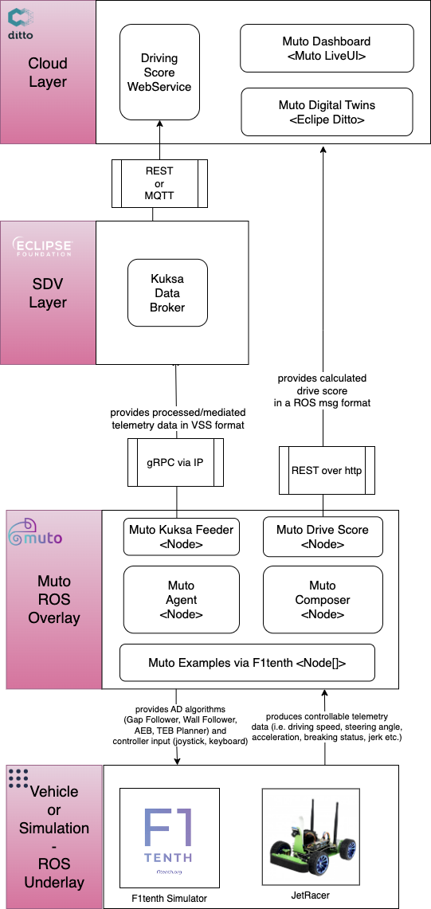
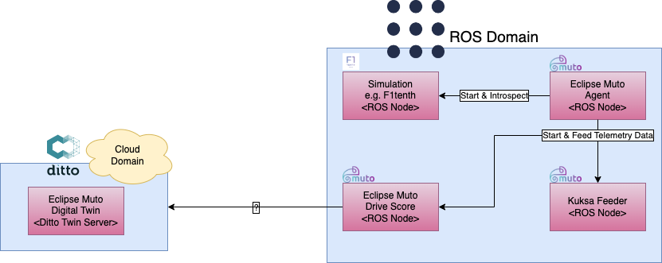

# Hack Challenge "Driving Score"
## Step 2 - Design the architecture and data flow

For a vehicle app to be able to calculate something, you need a **place to store and retrieve the vehicle data**. Instead of using raw CAN frames, use hardware abstraction layers to make your app easier to implement, test and deploy.

Consider using [Eclipse Kuksa.VAL Data Broker](https://github.com/eclipse/kuksa.val/tree/master/kuksa_databroker) as the Vehicle Data storage on the device. Also consider that vehicle signals have a high sampling frequency, eg usually in the milliseconds range. Thereas a higher level logic only needs data with a lower sampling frequency. **Plan a pre-processing step** into the lower layer of your data flow before sending it to the data broker to get rid of unnecessary details.

Another factor to consider is that your app is supposed to be deployed to a non-realtime compute domain. In a real system, it would be running next to another domain, the safety domain where a real-time capable operating system is running embedded services. If you want to explore this architecture, consider using the Xen hypervisor to deploy [Eclipse Leda](https://github.com/eclipse-leda/leda-distro) and [ROS](https://www.ros.org/) on the same physical device, as separated guests. This is more advanced and takes more time to set up, but let's you also explore the system integration aspects of a more realistic zone-oriented vehicle E/E architecture. A good source of information is [SOAFEE.io](https://soafee.io/)

## Example Architecture

The example architecture shows a basic setup and a more advanced setup (dotted red areas). This documentation only describes the basic setup and your team is free to explore the advanced setup.

## Example Data Flow

The overall dataflow could like like the following (from bottom to top):
- A driver controlling the vehicle (eg accelerator pedal position)
- A vehicle producing telemetry data (eg vehicle speed)
- A pre-processing step in the embedded layer (filtering, crunching, ...)
- The data broker for storing current values
- The vehicle app to calculate the driving style score for a single vehicle
- The cloud to visualize the scores for a fleet of cars

- References: [MDPI Whitepaper](https://www.mdpi.com/2079-9292/8/9/943/htm)

## Alternate Example Architecture (ROS)
Following is an alternative ROS architecture to extract telemetry data and calculate a driving score using Muto ROS components. 
Muto in-vehicle approach provides a ROS node `drive_score` that is already subscribed to the topics that capture
telemetry related information (i.e. steering angle, velocity,acceleration, jerk etc.)

## Alternate Example Data Flow (ROS)
A probable flow of data within the ROS domain via `Muto` could sequentially be described as follows:
- The simulation environment or the JetRacer is the data generation enviroment.
- Two main ways to produce data in these enviroments:
    - Running Muto AD algorithms (based on [f1tenth.org](f1tenth.org)) via `Muto Agent`.
        - Gap Follower
        - Wall Follower
        - Automatic Emergency Break
        - Time Elastic Band
    - Manually inputting actuator controls via `Muto BCX Command Plugin` that provides a joystick and a keyboard interface.
- Once the telemetry data is produced, two alternatives for calculating Driving Score.
    - Feed Kuksa Broker to loop data back to SDV layer (illustrated in the Example Architecture) via `Muto Kuksa-Feeder`.
    - Make use of a `Muto Drive Score` ROS node that is already subscribed to relevant topics to calculate a driving score.
- If the ROS way is chosen (i.e. an in-vehicle drive score is calculated in ROS domain ), one could feed `Muto Digital Twin` (based on Eclipse Ditto) via REST to register a driving score.
- Scores persisted in the Twin Server could be visualized in `Muto Dashboard` by crafting a `Muto LiveUI Widget`.

## Hints

- Think of the physical vehicle (chassis, motor, powertrain etc.) as a black box system for this hackathon. Accelerator position is an input into the vehicle, same goes for position of the steering wheel.
- The physical telemetry sensor in the vehicle can either produce the "Vehicle Speed" scalar value, or the "Vehicle Acceleration" vector, depending on the type of simulation tool you're using.
- VSS + Kuksa can manage structured values as well. `Vehicle.Acceleration` is a vector with the attributes `lateral`, `longitudinal`, `vertical`. However, if you continue with the pre-recorded CAN dump file, it only contains a scalar for `Vehicle.Speed`, so you need to calculate and store the acceleration on your own. Other simulation tools produce acceleration telemetry already.
- Implementing your own simulation: The math can become quiet complex. Try to [start simple](https://de.mathworks.com/help/driving/ref/bicyclemodel.html?s_tid=doc_ta) first and then iterate for fine tuning and detailing out your ideas. Don't get lost in complex [Vehicle Dynamics](https://www.mathworks.com/help/ident/ug/modeling-a-vehicle-dynamics-system.html).

Next: [Step 3: Pick Components](./step-3-pick-components.md)
