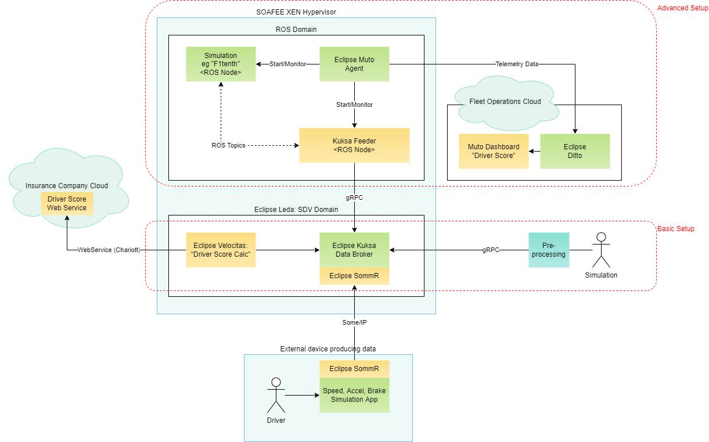

# Hack Challenge "Driving Score"
## Step 2 - Design the architecture and data flow

For a vehicle app to be able to calculate something, you need a place to store and retrieve the vehicle data. Instead of using raw CAN frames, use hardware abstraction layer to make your app easier to implement, test and deploy. Consider using Eclipse Kuksa Data Broker as the Vehicle Data storage on the device. Consider that vehicle signals have a high sampling frequency, eg usually in the milliseconds range. Thereas a higher level logic only needs data with a lower sampling frequency. Plan a pre-processing step into the lower layer of your data flow before sending it to the data broker to get rid of unnecessary details.

Another factor to consider is that your app is supposed to be deployed to a non-realtime compute domain. In a real system, it would be running next to another domain, the safety domain where a real-time capable operating system is running embedded services. If you want to explore the architecture, consider using the Xen hypervisor to deploy Eclipse Leda and ROS on the same physical device, as separated guests. This is more advanced and takes more time to set up, but let's you also explore the system integration.

## Example Architecture

## Example Data Flow

- References: [MDPI Whitepaper](https://www.mdpi.com/2079-9292/8/9/943/htm)

## Hints

- Think of the vehicle as a black box system
- Accelerator position is a "world" input into the vehicle, same goes for position of the steering wheel.
- The physical sensor in the vehicle can either produce the "Vehicle Speed" scalar value, or the "Vehicle Acceleration" vector, depending on the type of simulation tool you're using.
- Kuksa can manage structured values as well. `Vehicle.Acceleration` is a vector with the attributes `lateral`, `longitudinal`, `vertical`. However, if you continue with the pre-recorded CAN dump file, it only contains a scalar for `Vehicle.Speed`, so you need to calculate and store the acceleration on your own.

