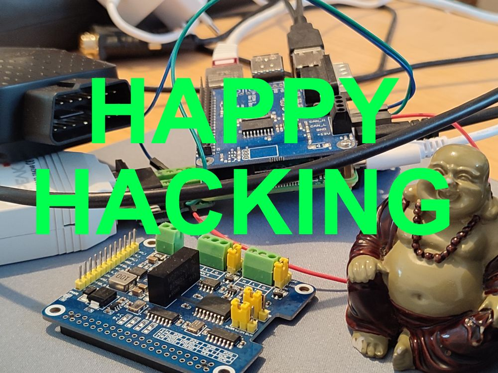

# Hack Challenge "Driving Score"
## Step 4 - Implement the driving score vehicle app

### What are you waiting for?
### Go find a hack team and start having fun at the hack challenge!

*If you need some hints, scroll down.*

                  

## Hints for Driving Score calculation

- Use the [Eclipse Velocitas Python Template](https://github.com/eclipse-velocitas/vehicle-app-python-template)
- Subscribe to the `Vehicle.Speed` data points. You may need the `timestamp` for proper calculation of the acceleration.
- The most complicated task is to calculate the jerk:
    
    $$ jerk = abs({da(t) \over dt})
    $$

- See [Jerk (physics)](https://en.wikipedia.org/wiki/Jerk_(physics)) to find out more about the physics and [Standards for passenger comfort in automated vehicles: Acceleration and jerk](https://www.sciencedirect.com/science/article/pii/S0003687022002046 )
- Find the peaks in the jerk. You may want to use [SciPy find_peaks()](https://docs.scipy.org/doc/scipy/reference/generated/scipy.signal.find_peaks.html)
- Count the number of peaks > 0.6 m/s³. A higher number is considered a bumpy ride (or bad driving style), a lower number is acceptable as a smooth ride (or good driving style).
- The score is then calculated based on the number of peaks over a specific time window
- Feel free to add additional input data to your algorithm later, such as how fast the steering wheel is rotated. Start simple.

Next: [Step 5: Build and deploy to a device](./step-5-build-deploy.md)

